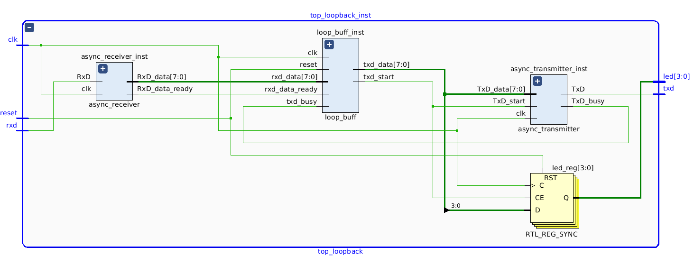

# impl/loopback

## Description

This project implements a loopback test on the FPGA.
It verifies that the RS-232 RX and TX modules in the async.v file
are operating correctly on real FPGA hardware.

## Status

Tested and working on the following boards:
* ice40_hx8k Breakout_Board
* Arty_S7 Digilent Board

## Usage

Generate bitstream for target board and write the bitstream to the board.

In the sw directory there are two programs that can be used to test:
* __ftdi_test__ : Characters you type are sent over the usb-serial link
and displayed on the leds.  Type 'q' to quit.
* __ice_cat__ <file.txt> : Streams file.txt to the FPGA board over the
usb-serial link.  Reports statistics on how fast the data transfer was.
Example:

```
> ./ice_cat Makefile
...
Setup ftdi
Initialized libftdi 1.4 (major: 1, minor: 4, micro: 0, snapshot version : v1.4-12-g91dbb65)
Created new ftdi
ftdi initialized
openned file: Makefile
bytes: 9355
Total time = 0.004870 seconds
bytes_per_sec: 1920944.558522
```


## Block Diagram

Here is a block diagram of the FPGA architecture.  This diagram
was generated by the Vivado 2018.2 Elaborate Design tool.




