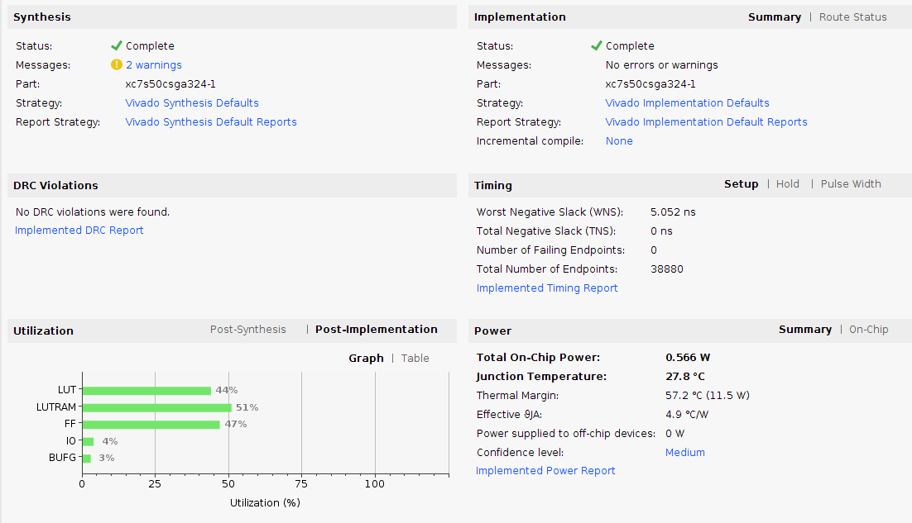

# top_md5/arty_s7

## Description

This directory implements the top_md5 project on the
[Arty S7-50T](https://reference.digilentinc.com/reference/programmable-logic/arty-s7/start) board from Digilent.
It is implemented using the Xilinx Vivado 2018.2 tools running
on Ubuntu 16.04 OS.

## Building the Project

Instead of storing the whole Vivado project in github
we store only a Tcl script which can generate the Vivado
project.  For more information see

[Version control for Vivado project](http://www.fpgadeveloper.com/2014/08/version-control-for-vivado-projects.html)

Here are the steps to build the project and start vivado on a
Linux system.

```
> source /opt/Xilinx/Vivado/2018.2/settings64.sh
> cd vivado_prj
> ./build.sh
> vivado arty_s7_md5/arty_s7_md5.xpr
```

## Report Summary




