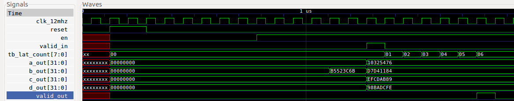

# hash_op_tb

## Description

A testbench for the hash_op module.  The testbench
uses iverilog and gtkwave.  It has a Makefile which has
the following targets:

* __compile__ : Default target. Compiles without running the simulation.  Good way to
  test for syntax errors.
* __run__ : Runs the simulation. Outputs PASS or FAIL to standard out.
  Generates a waveform vcd file.
* __view__ : Runs gtkwave and displays the waveform.
* __clean__ : Remove the generated files
* __help__ : Displays iverilog help

## Output

```
> make run
...
vvp hash_op.vvp
VCD info: dumpfile hash_op.vcd opened for output.
latency:   6
a_out:  271733878, a_good:  271733878
b_out: 3620999556, b_good: 3620999556
c_out: 4023233417, c_good: 4023233417
d_out: 2562383102, d_good: 2562383102
PASSED TEST
```

```
> make view
```




