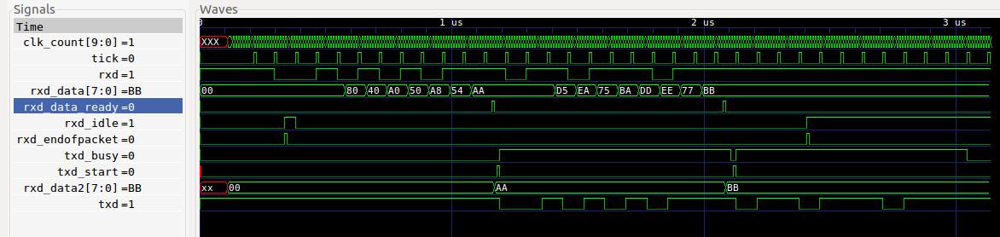

# loopback_tb

## Description

A testbench for the async module, which implements uart
functionality.  It instanitates the top_loopback module,
which receives data from the async_receiver and then
sends it back out the async_transmitter, hence loopback.

The testbench uses iverilog and gtkwave.  It has a Makefile which
has the following targets:

* __compile__ : Default target. Compiles without running the simulation.  Good way to
  test for syntax errors.
* __run__ : Runs the simulation. Outputs PASS or FAIL to standard out.
  Generates a waveform vcd file.
* __view__ : Runs gtkwave and displays the waveform.
* __clean__ : Remove the generated files
* __help__ : Displays iverilog help

## Output

```
> make run
...
vvp top_loopback.vvp
VCD info: dumpfile top_loopback.vcd opened for output.
rxd_data: aa, expected: aa, PASS
rxd_data: bb, expected: bb, PASS
CLK_FREQUENCY:    96000000, BAUD:    12000000
clks_per_tick:    8
```

```
> make view
```




