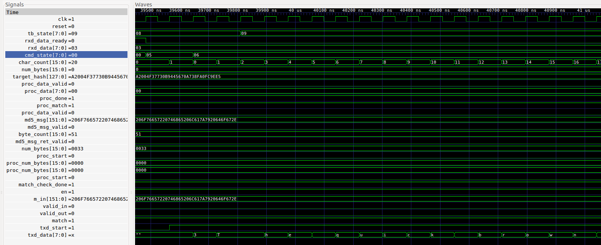

# md5_impl/sim

## Description

This directory holds a simulation for the three modules
cmd_parser, string_process_match, and top_md5 all working
together. This is almost the full design,  just leaving out
the uart and pll which have already been tested.

* __compile__ : Default target. Compiles without running the simulation.  Good way to
  test for syntax errors.
* __run__ : Runs the simulation. Outputs PASS or FAIL to standard out.
  Generates a waveform vcd file.
* __view__ : Runs gtkwave and displays the waveform.
* __clean__ : Remove the generated files
* __help__ : Displays iverilog help

## Output

```
> make run
...
vvp sim_top.vvp
VCD info: dumpfile sim_top.vcd opened for output.
TEST1 ACK:   1
TEST2 ACK:   1
byte_pos:    51
54 T
68 h
65 e
20  
71 q
75 u
69 i
63 c
6b k
20  
62 b
72 r
6f o
77 w
6e n
20  
66 f
6f o
78 x
```

```
> make view
```




