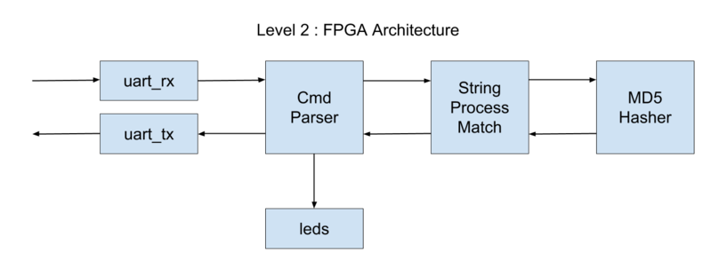

# md5_impl

## Description

This directory holds the top level design for the Level 2 Ducky
FPGA implementation.

## Block Diagram

Here is a block diagram of the FPGA architecture.

## Commands

The cmd_parser module receives 1 byte commands from the
usb to serial interface.  Parameters (multi-byte values) are sent LSB first (little endian).
Here is a summary of the commands:

* 0x01 target_hash[127:0] : Set the target hash.  Bytes are sent LSB first.
* 0x02 num[15:0] [byte0, byte1 .. byte[num-1]] : Receive 'num' characters/bytes. Returns 0x01 if
  hash found else 0x00.
* 0x03 num[15:0] [byte0, byte1 .. byte[num-1]] : Process 'num' characters/bytes. Use this command
  for the last chuck of data to make sure all characters are processed. Return 0x01 if hash found
  else 0x00.

