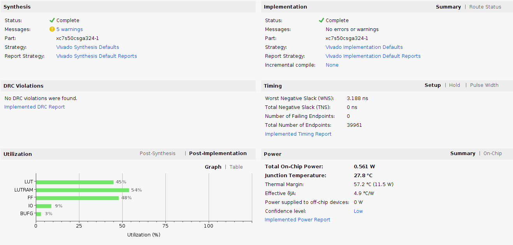

# top_md5/arty_s7

## Description

This directory implements the top_md5 project on the
[Arty S7-50T](https://reference.digilentinc.com/reference/programmable-logic/arty-s7/start) board from Digilent.
It is implemented using the Xilinx Vivado 2018.2 tools running
on Ubuntu 16.04 OS.

## Building the Project

You need to have the [Vivado Digilent board files](https://reference.digilentinc.com/reference/software/vivado/board-files?redirect=1)
installed.  You can get these from this [repo](https://github.com/Digilent/vivado-boards) 
on github.

Instead of storing the whole Vivado project in github
we store only a Tcl script which can generate the Vivado
project.  For more information see

[Version control for Vivado project](http://www.fpgadeveloper.com/2014/08/version-control-for-vivado-projects.html)

Here are the steps to build the project and start vivado on a
Linux system.

```
> source /opt/Xilinx/Vivado/2018.2/settings64.sh
> cd vivado_prj
> ./build.sh
> vivado arty_s7_md5/arty_s7_md5.xpr
```

__NOTE__ : This builds a project for the arty_s7 with the XC7S50 part.  If you have the arty_s7
with an XC7S25, you will have to update target board under Settings->General->Project device.
I have not tried building for the XC7S25 so it might not fit.  You probably have to update IO constraints
in the xdc file as well.

Once you have generated a bitstream you can open the Hardware Manager.  You should be able
to download the bitstream or write the bin file to the flash.  To write the bin file you
need to add "Add Configuration Memory Device" by right clicking on xc7s50 in the hardware window.
The spi-flash you need to add is "s25fl128sxxxxxx0-spi-x1_x2_x4".  Refer to the 
[Arty S7 Reference manual](https://reference.digilentinc.com/reference/programmable-logic/arty-s7/reference-manual) 
for more information.

## Report Summary




