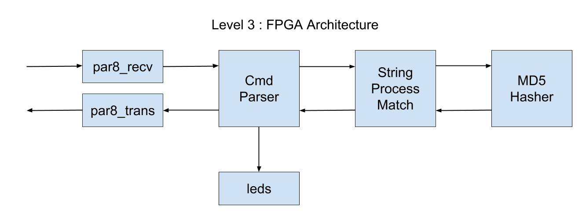

# impl/top_md5

## Description

This directory holds the top level design for the Level 3 MiniWheat
FPGA implementation.

## Status

Bitstream has been generate but not tested yet.

## Block Diagram

Here is a block diagram of the FPGA architecture.

## Commands

The cmd_parser module receives 1 byte commands from the
usb to serial interface.  Parameters (multi-byte values) are sent MSB first 
(big endian/network order).
Here is a summary of the commands:

* 0x01 target_hash[127:0] : Set the target hash.  Bytes are sent MSB first. Returns ACK (0x01).
* 0x02 num[15:0] [byte0, byte1 .. byte[num-1]] : Process 'num' characters/bytes. Returns ACK (0x01) if
  hash found else (0x00).
* 0x03 : Returns byte_pos[15:0] that matched hash followed by the STR_LEN character matched string. So STR_LEN+2 bytes in total. No ACK/NACK
* 0x04 : Test command.  Returns ten bytes 10, 9, 8, 7, ... 1.
* 0x05 : Set STR_LEN command.  Sent 1 byte.  Returns ACK (0x01) for success.

